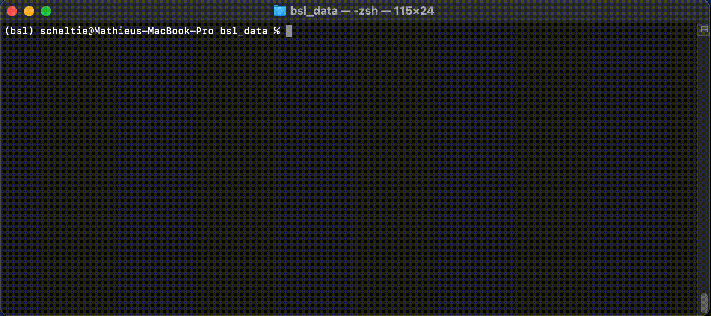
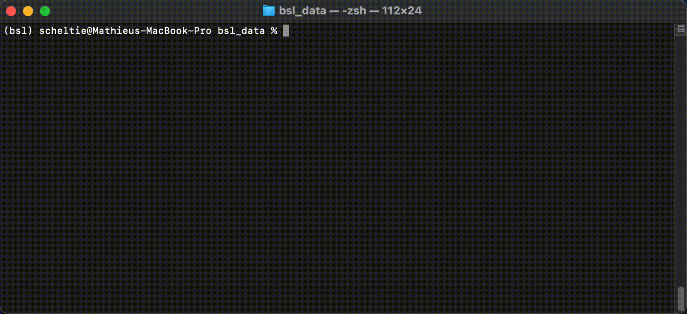

.. _cli:

============
Command-Line
============

BSL propose to use 3 of its main classes from the command line:

- :ref:`stream_player`
- :ref:`stream_recorder`
- :ref:`stream_viewer`

For each command, the flag `-h` can be used to obtain additional information.

.. _stream_player:

============
StreamPlayer
============

The :class:`~bsl.StreamPlayer` can be called from the command-line with:

.. code-block:: console

    $ bsl_stream_player stream_name fif_file

With the positional arguments:

- ``stream_name``: `str`, name of the LSL stream displayed on the network.
- ``fif_file``: `file-like`, recorded fif file by the StreamRecorder.

With the optional arguments:

- ``r``, ``--repeat``: `int`, number of time the file is repeated.
  Default ``+inf``.
- ``-t``, ``--trigger_def``: `file-like`, trigger file mapping events id to
  strings, loaded by :class:`~bsl.triggers.trigger_def.TriggerDef`.
- ``-c``, ``--chunk_size``: `int`, chunk size pushed on the outlet. Default
  ``16``.
- ``--high_resolution``: boolean flag, uses `time.perf_counter` instead of
  `time.sleep`.

.. _stream_recorder:

==============
StreamRecorder
==============

The :class:`~bsl.StreamRecorder` can be called from the command-line with:

.. code-block:: console

    $ bsl_stream_recorder

With the optional arguments:

- ``-d``, ``--directory``: `path-like`, path to the record directory.
- ``-f``, ``--fname``: `str`, file name stem.
- ``-s``, ``--stream_name``: `str`, stream to record.
- ``--fif_subdir``: boolean flag, saves in a ``fif`` subdirectory.
- ``--verbose``: boolean flag, displays a timer every recorded second.

.. note::

    If ``directory`` is not provided, the current working directory is used.
    If ``fname`` is not provided, a stem is generated based on the current
    datetime. If ``stream_name`` is not provided, all available streams are
    recorded.

.. _stream_viewer:

============
StreamViewer
============

The :class:`~bsl.StreamViewer` can be called from the command-line with:

.. code-block:: console

    $ bsl_stream_viewer

With the optional arguments:

- ``-s``, ``--stream_name``: `str`, stream to visualize.

.. note::

    If ``stream_name`` is not provided, a prompt is displayed to select a
    stream among the available ones.

The :class:`~bsl.StreamViewer` opens 2 windows:

- A controller to select the channels to plot and set different plotting
  parameters.
- A plotting window using the ``pyqtgraph`` backend displaying the signal in
  real-time.

.. image:: _static/stream_viewer/stream_viewer.gif
   :alt: StreamViewer
   :align: center
