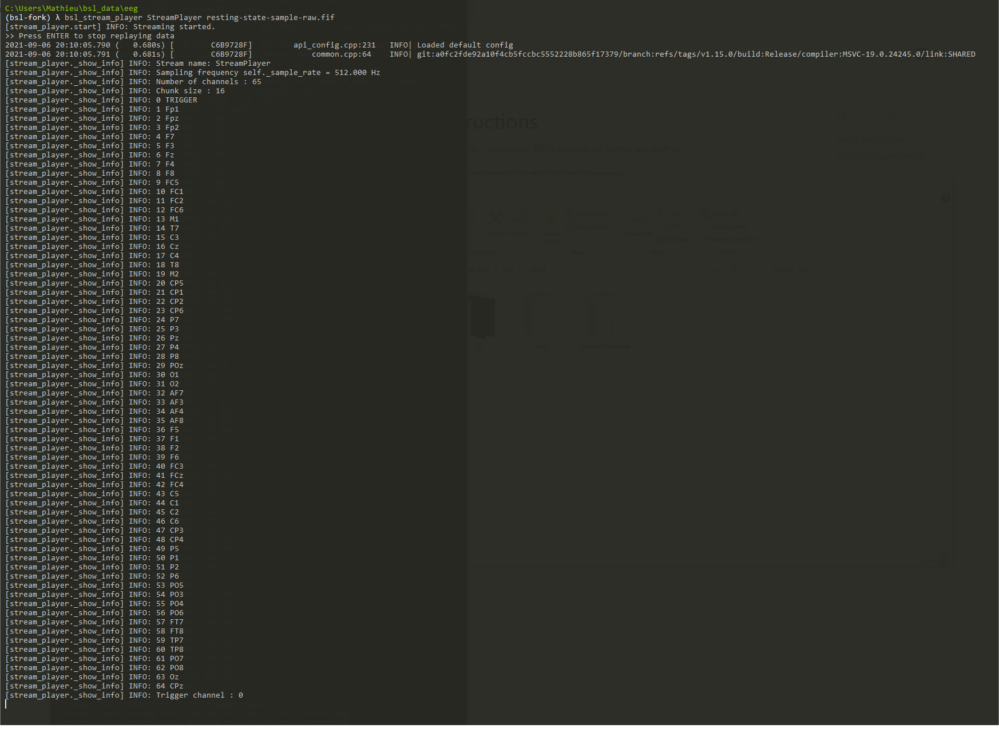
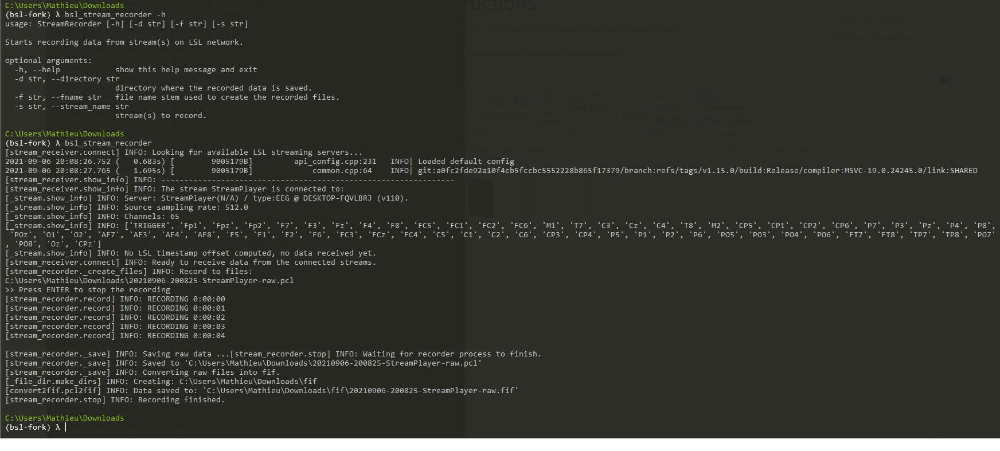
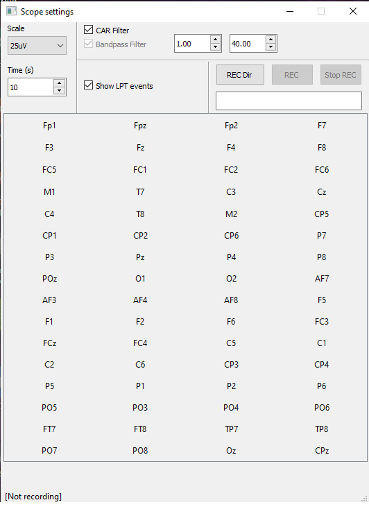
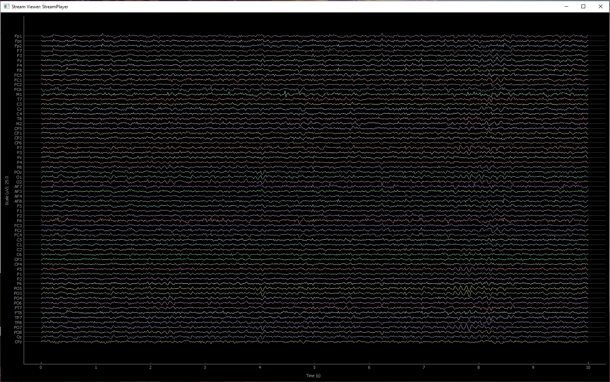

.. _cli:

============
Command-Line
============

BSL propose to use 3 of his main classes from the command line:

- :ref:`stream_player`
- :ref:`stream_recorder`
- :ref:`stream_viewer`

For each command, the flag `-h` can be used to obtain additionnal information.

.. _stream_player:

============
StreamPlayer
============

The :class:`~bsl.StreamPlayer` can be called from the command-line with:

.. code-block:: console

    $ bsl_stream_player stream_name fif_file

With the positional arguments:

- `stream_name`: str, name of the LSL stream displayed on the network.
- `fif_file`: path, recorded fif file by the StreamRecorder.

With the optional arguments:

- `-c`, `--chunk_size`: int, chunk size pushed on the outlet. Default 16.
- `-t`, `--trigger_file`: path, trigger file mapping events id to strings,
  loaded by :class:`~bsl.triggers.trigger_def.TriggerDef`.

.. _stream_recorder:

==============
StreamRecorder
==============

The :class:`~bsl.StreamRecorder` can be called from the command-line with:

.. code-block:: console

    $ bsl_stream_recorder

With the optional arguments:

- `-d`, `--directory`: path to the record directory.
- `-f`, `--fname`: file name stem.
- `-s`, `--stream_name`: stream to record.

 | If the path to the record directory is not provided, starts in the current
   directory.
 | If the file name stem is not provided, a stem is generated based on the
   current datetime.
 | If the stream to record is not provided, record all streams.

.. _stream_viewer:

============
StreamViewer
============

The :class:`~bsl.StreamViewer` can be called from the command-line with:

.. code-block:: console

    $ bsl_stream_viewer

With the optional arguments:

- `-s`, `--stream_name`: stream to visualize.
- `-b`, `--backend`: visualization backend.

 | If the stream to visualize is not provided, a prompt let the user select one
   of the available streams on the network.
 | If the backend is not provided, the default backend `pyqtgraph` is used.

The :class:`~bsl.StreamViewer` opens 2 windows:

- A controller to select the channels to plot and set different plotting
  parameters.

- A plotting window using the specified backend displaying the signal in
  real-time.

