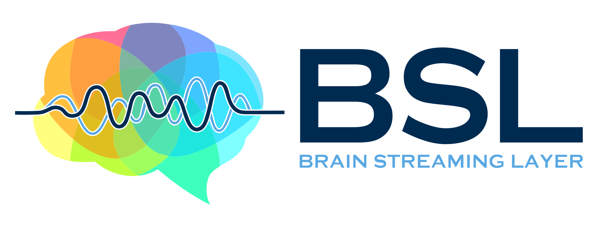

.. title:: BSL

.. The page title must be in rST for it to show in next/prev page buttons.
   Therefore we add a special style rule to only this page that hides h1 tags

.. raw:: html

    

Brain Streaming Layer Homepage
==============================

.. LOGO

.. rst-class:: h4 text-center font-weight-light my-4

   Open-source Python package for a real-time brain signal streaming framework
   based around the `Lab Streaming Layer (LSL)
   <https://labstreaminglayer.readthedocs.io/info/intro.html>`_.

.. toctree::
   :hidden:

   Install<install>
   Examples<generated_examples/index>
   API Reference<api_reference>
   Command Line<command_line>
   Changelog<changes/index>
