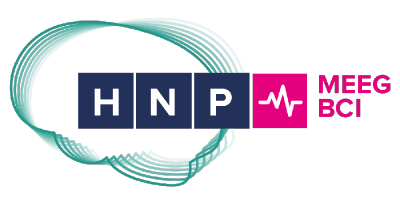

:hide-toc:

.. include:: ./links.inc

MNE-LSL
=======

Open-source Python package for real-time brain signal streaming framework
based on the `Lab Streaming Layer (LSL) <lsl intro_>`_.

Install
-------

``MNE-LSL`` is available on `PyPI <project pypi_>`_ and `conda-forge <project conda_>`_.
It requires a compatible version of `liblsl <lsl lib_>`_ which will be automatically
fetched from the `liblsl release page <lsl lib release_>`_ if possible.

.. tab-set::

    .. tab-item:: MNE installers

        As of MNE-Python 1.6, ``mne-lsl`` is distributed in the
        `MNE standalone installers <mne installers_>`_.

        The installers create a conda environment with the entire MNE-ecosystem
        setup, and more! This installation method is recommended for beginners.

    .. tab-item:: PyPI

        ``mne-lsl`` can be installed from `PyPI <project pypi_>`_ using pip:

        .. code-block:: console

            $ pip install mne-lsl

    .. tab-item:: Conda

        ``mne-lsl`` can be installed from `conda-forge <project conda_>`_ using conda:

        .. code-block:: console

            $ conda install -c conda-forge mne-lsl

    .. tab-item:: Source

        ``mne-lsl`` can be installed from `GitHub <project github_>`_:

        .. code-block:: console

            $ pip install git+https://github.com/mne-tools/mne-lsl

Supporting institutions
-----------------------

The development of ``MNE-LSL`` is supported by the
`Human Neuroscience Platform, Fondation Campus Biotech Geneva <fcbg hnp_>`_.

.. toctree::
    :hidden:

    resources/install.rst
    api/index.rst
    resources/command_line.rst
    generated/tutorials/index.rst
    generated/examples/index.rst
    changes/index.rst
